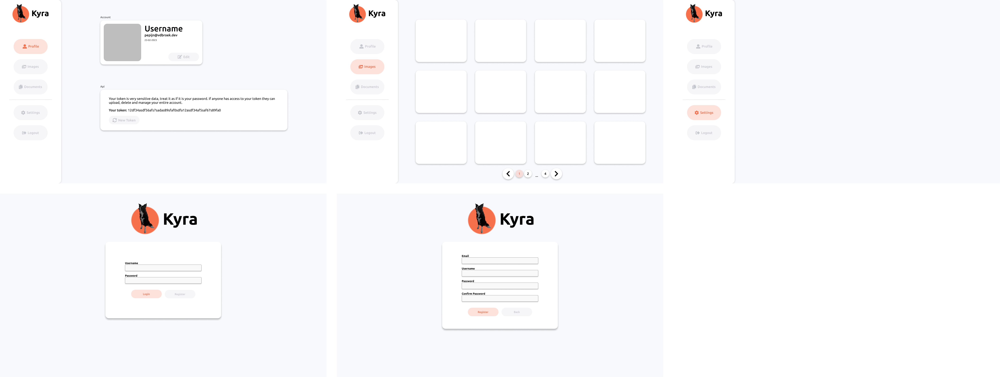
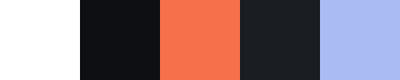

# Kyra

## **Potential design [figma](https://www.figma.com/file/4TpgZ6W9IffYfAVPuYn4t0/Kyra-Dashboard?type=design&node-id=0%3A1&t=49Y8jL65u7o525hH-1)**

## **Updated Color Palette**
#### **Light Theme**
Primary: `#000000` (RGB: 0, 0, 0) \
Secondary: `#f1f0ed` (RGB: 241, 240, 237) \
Primary Button: `#f5704b` (RGB: 245, 112, 75) \
Secondary Button: `#e5e2de` (RGB: 229, 226, 222) \
Accent: `#aabaf3` (RGB: 170, 186, 243) \

#### **Dark Theme**
Primary: `#ffffff` (RGB: 255, 255, 255) \
Secondary: `#0e0f12` (RGB: 14, 15, 18) \
Primary Button: `#f5704b` (RGB: 245, 112, 75) \
Secondary Button: `#1a1d21` (RGB: 26, 29, 33) \
Accent: `#aabaf3` (RGB: 170, 186, 243) \

